# 项目结构总览


## Structure Diagram

```mermaid
graph TD
    ___[...]
    CodeReviewerBot[CodeReviewerBot]
    LICENSE[LICENSE]
    README_md[README.md]
    STRUCTURE_md[STRUCTURE.md]
    build_binary_py[build_binary.py]
    build_linux_py[build_linux.py]
    config_yaml_example[config.yaml.example]
    crb_spec[crb.spec]
    crb_test_spec[crb_test.spec]
    docs[docs]
    docs_README_md[README.md]
    docs_需求文档_md[需求文档.md]
    docs_项目进度_md[项目进度.md]
    pyproject_toml[pyproject.toml]
    scripts[scripts]
    scripts_build_py[build.py]
    scripts_docs_gen_agent_py[docs_gen_agent.py]
    scripts_test_docs_stability_py[test_docs_stability.py]
    src[src]
    src_codereviewerbot_egg_info[codereviewerbot.egg-info]
    src_codereviewerbot_egg_info_PKG_INFO[PKG-INFO]
    src_codereviewerbot_egg_info_SOURCES_txt[SOURCES.txt]
    src_codereviewerbot_egg_info_dependency_links_txt[dependency_links.txt]
    src_codereviewerbot_egg_info_entry_points_txt[entry_points.txt]
    src_codereviewerbot_egg_info_requires_txt[requires.txt]
    src_codereviewerbot_egg_info_top_level_txt[top_level.txt]
    src_crb[crb]
    src_crb___init___py[__init__.py]
    src_crb___main___py[__main__.py]
    src_crb_agents[agents]
    src_crb_analyzers[analyzers]
    src_crb_cli[cli]
    src_crb_config[config]
    src_crb_llm[llm]
    structure_data_json[structure-data.json]
    structure_viewer_html[structure-viewer.html]
    test_click_spec[test_click.spec]
    test_pyi_spec[test_pyi.spec]
    tests[tests]
    tests_test_python_analyzer_py[test_python_analyzer.py]

    CodeReviewerBot --> LICENSE
    CodeReviewerBot --> README_md
    CodeReviewerBot --> STRUCTURE_md
    CodeReviewerBot --> build_binary_py
    CodeReviewerBot --> build_linux_py
    CodeReviewerBot --> config_yaml_example
    CodeReviewerBot --> crb_spec
    CodeReviewerBot --> crb_test_spec
    CodeReviewerBot --> docs
    CodeReviewerBot --> pyproject_toml
    CodeReviewerBot --> scripts
    CodeReviewerBot --> src
    CodeReviewerBot --> structure_data_json
    CodeReviewerBot --> structure_viewer_html
    CodeReviewerBot --> test_click_spec
    CodeReviewerBot --> test_pyi_spec
    CodeReviewerBot --> tests
    docs --> docs_README_md
    docs --> docs_需求文档_md
    docs --> docs_项目进度_md
    scripts --> scripts_build_py
    scripts --> scripts_docs_gen_agent_py
    scripts --> scripts_test_docs_stability_py
    src --> src_codereviewerbot_egg_info
    src --> src_crb
    src_codereviewerbot_egg_info --> src_codereviewerbot_egg_info_PKG_INFO
    src_codereviewerbot_egg_info --> src_codereviewerbot_egg_info_SOURCES_txt
    src_codereviewerbot_egg_info --> src_codereviewerbot_egg_info_dependency_links_txt
    src_codereviewerbot_egg_info --> src_codereviewerbot_egg_info_entry_points_txt
    src_codereviewerbot_egg_info --> src_codereviewerbot_egg_info_requires_txt
    src_codereviewerbot_egg_info --> src_codereviewerbot_egg_info_top_level_txt
    src_crb --> src_crb___init___py
    src_crb --> src_crb___main___py
    src_crb --> src_crb_agents
    src_crb --> src_crb_analyzers
    src_crb --> src_crb_cli
    src_crb --> src_crb_config
    src_crb --> src_crb_llm
    src_crb_agents --> ___
    src_crb_analyzers --> ___
    src_crb_cli --> ___
    src_crb_config --> ___
    src_crb_llm --> ___
    tests --> tests_test_python_analyzer_py
```


## File Tree

```
CodeReviewerBot
├── LICENSE
├── README.md
├── STRUCTURE.md
├── build_binary.py
├── build_linux.py
├── config.yaml.example
├── crb.spec
├── crb_test.spec
├── docs
│   ├── README.md
│   ├── 需求文档.md
│   └── 项目进度.md
├── pyproject.toml
├── scripts
│   ├── build.py
│   ├── docs_gen_agent.py
│   └── test_docs_stability.py
├── src
│   ├── codereviewerbot.egg-info
│   │   ├── PKG-INFO
│   │   ├── SOURCES.txt
│   │   ├── dependency_links.txt
│   │   ├── entry_points.txt
│   │   ├── requires.txt
│   │   └── top_level.txt
│   └── crb
│       ├── agents
│       │   ├── commit_organizer_agent.py
│       │   ├── doc_consistency_agent.py
│       │   ├── fix_agent.py
│       │   ├── review_agent.py
│       │   ├── semantic_agent.py
│       │   └── structure_agent.py
│       ├── analyzers
│       │   ├── c_cpp
│       │   │   └── reporter.py
│       │   ├── detector.py
│       │   ├── generic
│       │   │   └── structure_analyzer.py
│       │   ├── generic.py
│       │   ├── go
│       │   │   └── reporter.py
│       │   ├── python
│       │   │   ├── bloat_detector.py
│       │   │   ├── bug_detector.py
│       │   │   ├── comment_detector.py
│       │   │   ├── complexity.py
│       │   │   ├── dead_code_detector.py
│       │   │   ├── dependency_detector.py
│       │   │   ├── design_detector.py
│       │   │   ├── edge_case_detector.py
│       │   │   ├── multi_agent.py
│       │   │   ├── orphan_detector.py
│       │   │   ├── reporter.py
│       │   │   ├── retry_detector.py
│       │   │   ├── style_checker.py
│       │   │   ├── test_theater_detector.py
│       │   │   └── third_party_suggester.py
│       │   ├── rust
│       │   │   └── reporter.py
│       │   └── secret_detector.py
│       ├── cli
│       │   └── main.py
│       ├── config
│       │   └── settings.py
│       └── llm
│           └── client.py
├── structure-data.json
├── structure-viewer.html
├── test_click.spec
├── test_pyi.spec
└── tests
    └── test_python_analyzer.py
```
## Modules

- [docs](docs/structure.md)
- [scripts](scripts/structure.md)
- [src](src/structure.md)
- [tests](tests/structure.md)
