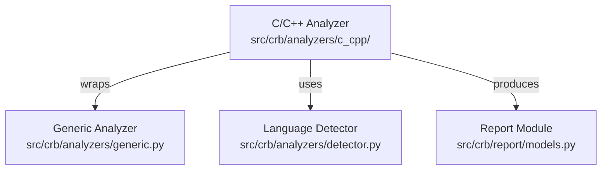

# C/C++ Analyzer Module

## 结构图

## 文件树

| 节点 | 路径 | 功能 |
|------|------|------|
| C/C++ Reporter | `src/crb/analyzers/c_cpp/reporter.py` | Entry point for C/C++ analysis, wraps generic analyzer |

### 关键函数

| 函数 | 所在文件 | 功能 |
|------|---------|------|
| `analyze_files()` | `reporter.py` | Orchestrates C/C++ file analysis using generic line-based analyzer |

> 上层结构：[分析器总图](../../../STRUCTURE.md)
