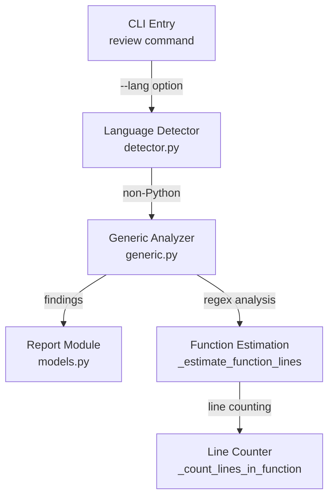

# Generic Analyzer Module

## 结构图

## 文件树

| 节点 | 路径 | 功能 |
|------|------|------|
| Generic Analyzer | `src/crb/analyzers/generic.py` | Line-based analysis for non-Python languages (C/C++, Go, Rust) |
| Language Detector | `src/crb/analyzers/detector.py` | Detects programming language from file extensions |

## 关键函数

| 函数 | 所在文件 | 功能 |
|------|---------|------|
| `analyze_file()` | `generic.py` | Main entry point: analyzes a single source file for complexity issues |
| `_estimate_function_lines()` | `generic.py` | Estimates function length using regex pattern matching |
| `_count_lines_in_function()` | `generic.py` | Counts actual lines within a detected function block |

> 上层结构：[分析器总图](../structure.md)
