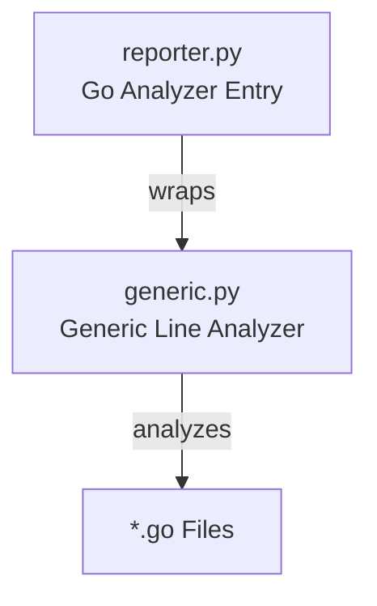

# Go Analyzer Module

## 结构图

## 文件树

| 节点 | 路径 | 功能 |
|------|------|------|
| reporter.py | `src/crb/analyzers/go/reporter.py` | Go analyzer entry point, wraps generic line-based analyzer |
| generic.py | `src/crb/analyzers/generic.py` | Generic line-based analysis for non-Python languages |

### 关键函数

| 函数 | 所在文件 | 功能 |
|------|---------|------|
| `analyze_files()` | `reporter.py` | Orchestrates Go file analysis by calling generic analyzer |
| `analyze_file()` | `generic.py` | Performs line-based analysis on a single Go file |
| `_estimate_function_lines()` | `generic.py` | Estimates function line count using regex patterns |
| `_count_lines_in_function()` | `generic.py` | Counts lines within a detected function block |

> 上层结构：[项目总图](../structure.md)
