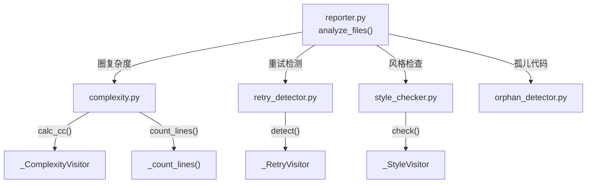

# Python Analyzer 模块

## 结构图

## 文件树

| 节点 | 路径 | 功能 |
|------|------|------|
| reporter.py | `src/crb/analyzers/python/reporter.py` | 编排分析流程：复杂度→重试→风格 |
| complexity.py | `src/crb/analyzers/python/complexity.py` | AST遍历计算圈复杂度、函数行数 |
| retry_detector.py | `src/crb/analyzers/python/retry_detector.py` | 检测装饰器重试、循环重试、递归重试 |
| orphan_detector.py | `src/crb/analyzers/python/orphan_detector.py` | 跨文件孤儿代码检测 |
| style_checker.py | `src/crb/analyzers/python/style_checker.py` | AST风格检查（通配符导入、全局变量、短变量名） |

### 关键函数

| 函数 | 所在文件 | 功能 |
|------|---------|------|
| `analyze_file()` | complexity.py | 分析单个 .py 文件，返回复杂度发现 |
| `analyze_directory()` | complexity.py | 递归分析目录 |
| `analyze_file()` | retry_detector.py | 分析单个 .py 文件的错误重试 |
| `analyze_file()` | style_checker.py | 分析单个 .py 文件代码风格 |
| `analyze_files()` | reporter.py | 编排所有分析，生成 ReviewReport |

---

> 上层结构：[项目总图](../../../STRUCTURE.md)
