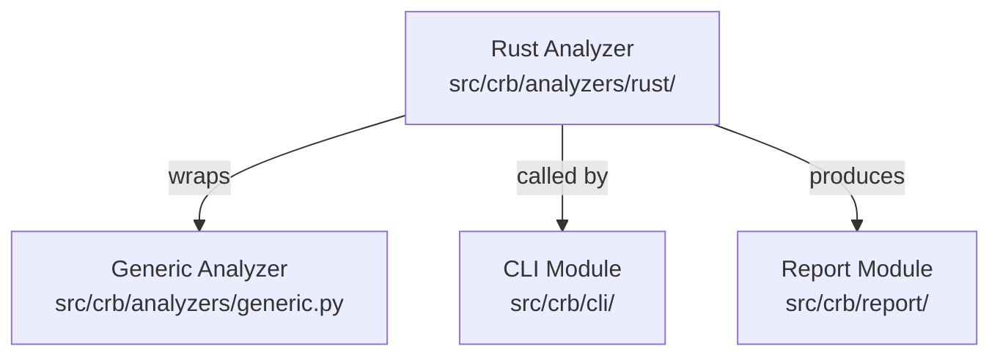

# Rust Analyzer Module

## 结构图

## 文件树

| 节点 | 路径 | 功能 |
|------|------|------|
| Rust Analyzer | `src/crb/analyzers/rust/reporter.py` | Orchestrates Rust file analysis using generic line-based analyzer |

### 关键函数

| 函数 | 所在文件 | 功能 |
|------|---------|------|
| `analyze_files()` | `reporter.py` | Analyzes all Rust files in the given list, delegates to generic analyzer |

> 上层结构：[分析器总图](../structure.md)
