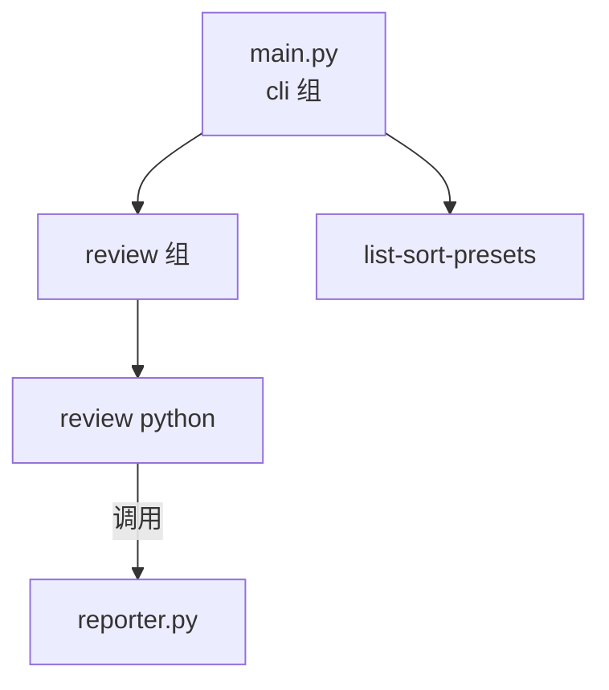

# CLI 模块

## 结构图

## 文件树

| 节点 | 路径 | 功能 |
|------|------|------|
| main.py | `src/crb/cli/main.py` | Click CLI 入口，review python / list-sort-presets 命令 |

### 关键命令

| 命令 | 功能 |
|------|------|
| `crb review python <paths>` | 审查 Python 源文件 |
| `crb list-sort-presets` | 列出可用的排序预设 |

### 选项

| 选项 | 说明 |
|------|------|
| `--sort` | 排序策略（default / severity-up / critical-first / 自定义） |
| `-o` / `--output` | 输出格式（markdown / json） |
| `--report-dir` | 报告输出目录（默认 ./report） |

---

> 上层结构：[项目总图](../../STRUCTURE.md)
