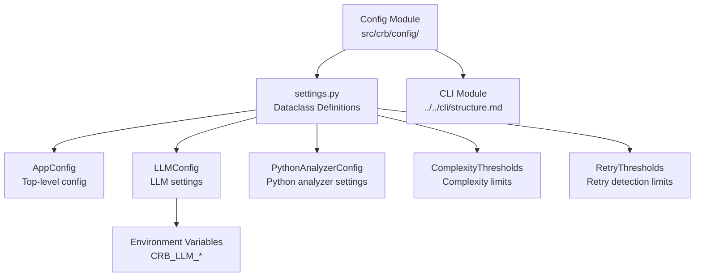

# Config Module

## 结构图

## 文件树

| 节点 | 路径 | 功能 |
|------|------|------|
| settings.py | `src/crb/config/settings.py` | 定义所有配置数据类，支持环境变量读取 |

### 关键函数

| 函数 | 所在文件 | 功能 |
|------|---------|------|
| `ComplexityThresholds` | `settings.py` | 复杂度阈值数据类（行数、嵌套深度等） |
| `RetryThresholds` | `settings.py` | 重试检测阈值数据类 |
| `PythonAnalyzerConfig` | `settings.py` | Python分析器配置（包含复杂度与重试阈值） |
| `LLMConfig` | `settings.py` | LLM配置（从环境变量读取URL、Key、Model） |
| `AppConfig` | `settings.py` | 顶层应用配置（包含LLM和Python分析器配置） |

> 上层结构：[项目总图](../../STRUCTURE.md)
