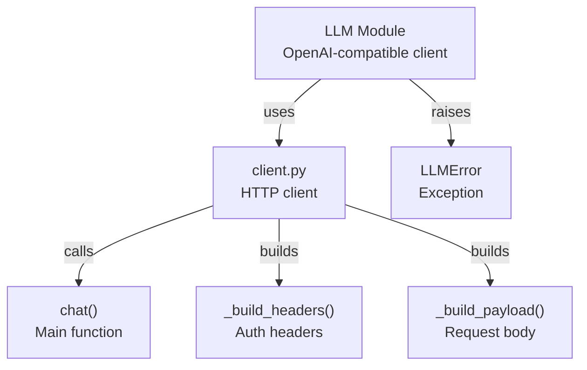

# LLM Module

## 结构图

## 文件树

| 节点 | 路径 | 功能 |
|------|------|------|
| LLM Module | `src/crb/llm/` | OpenAI-compatible HTTP client for code review |
| client.py | `src/crb/llm/client.py` | Core HTTP client implementation |
| LLMError | `src/crb/llm/client.py` | Custom exception for LLM errors |

### 关键函数

| 函数 | 所在文件 | 功能 |
|------|---------|------|
| `chat()` | `client.py` | Main function to send chat requests to LLM API |
| `_build_headers()` | `client.py` | Builds authentication headers with API key |
| `_build_payload()` | `client.py` | Constructs request payload with model and messages |

> 上层结构：[项目总图](../../STRUCTURE.md)
