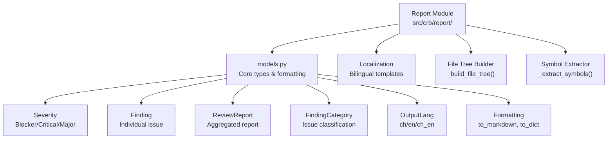

# Report Module

## 结构图

## 文件树

| 节点 | 路径 | 功能 |
|------|------|------|
| Report Module | `src/crb/report/` | Core report types, localization, and formatting |
| models.py | `src/crb/report/models.py` | All report data models and formatting logic (539 lines) |

### 关键函数

| 函数 | 所在文件 | 功能 |
|------|---------|------|
| `Severity` | `models.py` | Enum: Blocker, Critical, Major (line 15) |
| `OutputLang` | `models.py` | Enum: ch, en, ch_en (line 25) |
| `FindingCategory` | `models.py` | Enum: ~14 finding categories (line 292) |
| `Finding` | `models.py` | Dataclass for individual finding (line 308) |
| `ReviewReport` | `models.py` | Dataclass for aggregated report (line 330) |
| `_lbl()` | `models.py` | Localization label lookup |
| `_finding_msg()` | `models.py` | Generate bilingual finding message |
| `sort_key()` | `models.py` | Sort key for findings |
| `to_dict()` | `models.py` | Convert report to dictionary |
| `set_sort_order()` | `models.py` | Set sort order for findings |
| `sort_findings()` | `models.py` | Sort findings by criteria |
| `add_finding()` | `models.py` | Add finding to report |
| `blocker_count()` | `models.py` | Count blocker severity findings |
| `critical_count()` | `models.py` | Count critical severity findings |
| `major_count()` | `models.py` | Count major severity findings |
| `_extract_symbols()` | `models.py` | Extract symbols from source files |
| `_build_file_tree()` | `models.py` | Build file tree from filesystem |
| `_render_tree()` | `models.py` | Render file tree as string |
| `to_markdown()` | `models.py` | Convert report to markdown |

> 上层结构：[项目总图](../structure.md)
