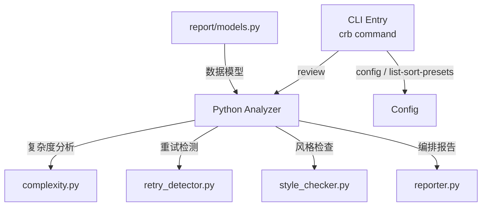

# CodeReviewerBot 项目结构

## 总体结构图

## 文件树

| 节点 | 路径 | 功能 |
|------|------|------|
| CLI | `src/crb/cli/main.py` | 命令行入口，review/config 子命令 |
| Python Analyzer | `src/crb/analyzers/python/` | Python 代码审查模块 |
| complexity.py | `src/crb/analyzers/python/complexity.py` | 圈复杂度 & 函数行数分析 |
| retry_detector.py | `src/crb/analyzers/python/retry_detector.py` | 错误重试模式检测 |
| style_checker.py | `src/crb/analyzers/python/style_checker.py` | 代码风格检查 |
| reporter.py | `src/crb/analyzers/python/reporter.py` | 审查结果编排 & 报告生成 |
| Report Models | `src/crb/report/models.py` | Finding/Report 数据模型，分级排序 |
| Config | `src/crb/config/settings.py` | 可配置阈值和参数 |

---

> 下层结构文档：
> - [CLI 模块](cli/structure.md)
> - [配置模块](config/structure.md)
> - [报告模型](report/structure.md)
> - [LLM 客户端](llm/structure.md)
> - [通用分析器](analyzers/generic/structure.md)
> - [Python 分析器](analyzers/python/structure.md)
> - [C/C++ 分析器](analyzers/c_cpp/structure.md)
> - [Go 分析器](analyzers/go/structure.md)
> - [Rust 分析器](analyzers/rust/structure.md)
