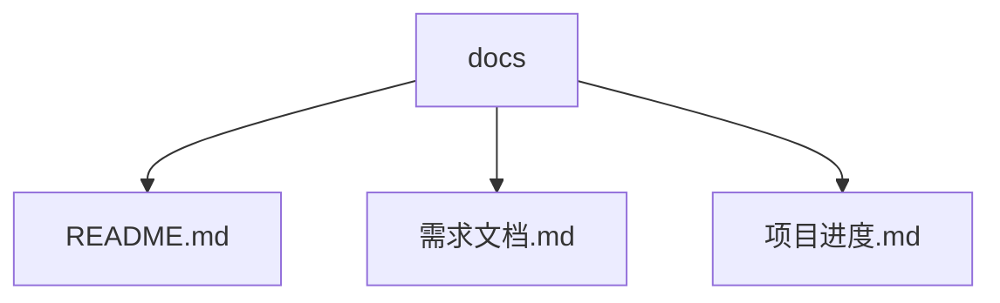

# Module: Docs

[⬆ 返回顶层结构](../structure.md)

## Structure Diagram


```mermaid
graph TD
    README_md[README.md]
    docs[docs]
    需求文档_md[需求文档.md]
    项目进度_md[项目进度.md]

    docs --> README_md
    docs --> 需求文档_md
    docs --> 项目进度_md
```
## File Tree

```
docs
├── README.md
├── 需求文档.md
└── 项目进度.md
```
